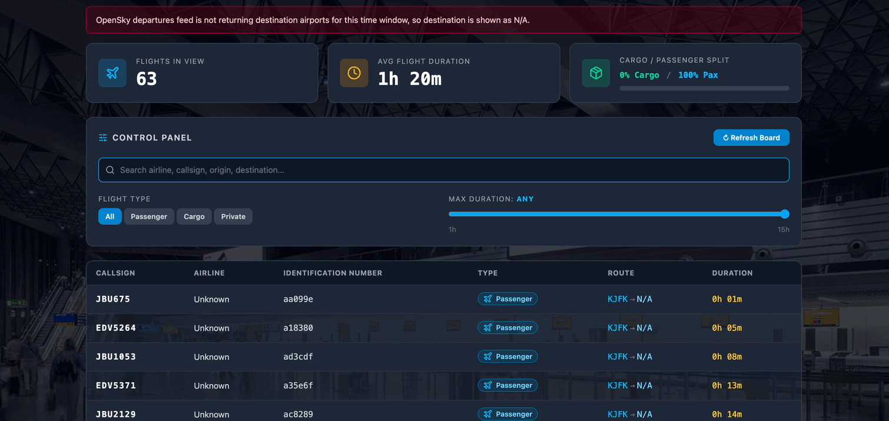

# AeroTrack (OpenSky Network)

AeroTrack is a React + Vite flight dashboard that fetches departure flights from OpenSky Network using OAuth client credentials.

In development, the app calls a local Vite proxy endpoint (`/api/opensky/departures`) that handles token exchange server-side to avoid browser CORS issues.

## 1) Install

```bash
npm install
```

## 2) Configure environment variables

Create `.env.local` in the project root:

```env
VITE_OPENSKY_CLIENT_ID=your_client_id
VITE_OPENSKY_CLIENT_SECRET=your_client_secret
VITE_OPENSKY_API_BASE_URL=https://opensky-network.org/api
VITE_OPENSKY_TOKEN_URL=https://auth.opensky-network.org/auth/realms/opensky-network/protocol/openid-connect/token
VITE_OPENSKY_AIRPORT_ICAO=KJFK,KLAX,KSFO
VITE_OPENSKY_FLIGHT_DATE=
VITE_OPENSKY_WINDOW_START_HOUR=0
VITE_OPENSKY_WINDOW_HOURS=12
VITE_OPENSKY_LOOKBACK_DAYS=3
VITE_OPENSKY_REQUEST_DELAY_MS=1100
VITE_OPENSKY_TABLE_LIMIT=100
```

Required:
- `VITE_OPENSKY_CLIENT_ID`
- `VITE_OPENSKY_CLIENT_SECRET`

Optional:
- `VITE_OPENSKY_API_BASE_URL` (default: `https://opensky-network.org/api`)
- `VITE_OPENSKY_TOKEN_URL` (default in file above)
- `VITE_OPENSKY_AIRPORT_ICAO` comma-separated ICAO list (default: `KJFK`)
- `VITE_OPENSKY_FLIGHT_DATE` in `YYYY-MM-DD` format (if set, uses fixed single-day mode)
- `VITE_OPENSKY_WINDOW_START_HOUR` from `0` to `23` (default: `0`)
- `VITE_OPENSKY_WINDOW_HOURS` from `1` to `24` (default: `12`)
- `VITE_OPENSKY_LOOKBACK_DAYS` from `1` to `7` (default: `3`, excludes current UTC day in rolling mode)
- `VITE_OPENSKY_REQUEST_DELAY_MS` delay between airport requests in ms (default: `1100`)
- `VITE_OPENSKY_TABLE_LIMIT` initial dashboard table row limit (default: `100`, max: `2000`)

Behavior:
- If `VITE_OPENSKY_FLIGHT_DATE` is empty, the app fetches a rolling window from today 00:00 UTC minus `VITE_OPENSKY_LOOKBACK_DAYS` up to today 00:00 UTC.
- Full fetched results are used for statistics/charts. The table can show first X rows via the Control Panel selector.

Notes:
- Multi-airport mode sends one request per airport, so API usage increases quickly with long airport lists.
- Requests are executed sequentially with delay to reduce 429 spikes.
- OpenSky payload may not include aircraft model/manufacturer for every flight. The UI falls back to identification values like `icao24`.
- After changing `.env.local`, restart `npm run dev` so the Vite proxy reloads updated credentials.

## 3) Run in development

```bash
npm run dev
```

## 4) Build for production

```bash
npm run build
npm run preview
```

## Troubleshooting

- If you see missing credentials error, check `VITE_OPENSKY_CLIENT_ID` and `VITE_OPENSKY_CLIENT_SECRET` in `.env.local`.
- If auth fails (`401` or `403`), verify your OpenSky client credentials and token URL.
- If you receive `429`, reduce airport count and increase `VITE_OPENSKY_REQUEST_DELAY_MS`.
- If no flights are returned, try fewer airports, a wider time window, or a different date.


